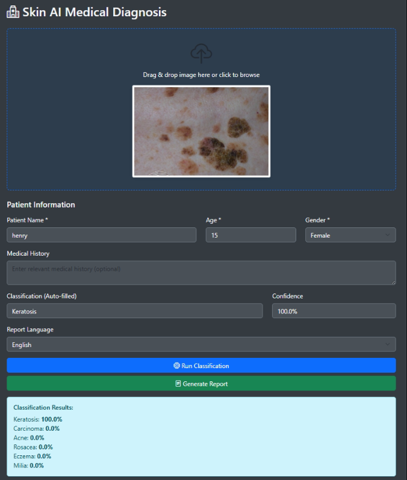
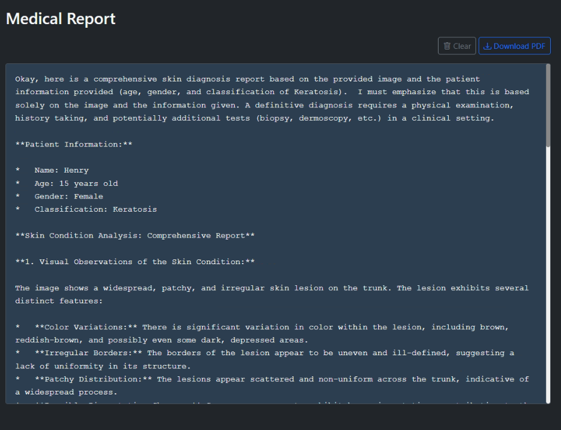
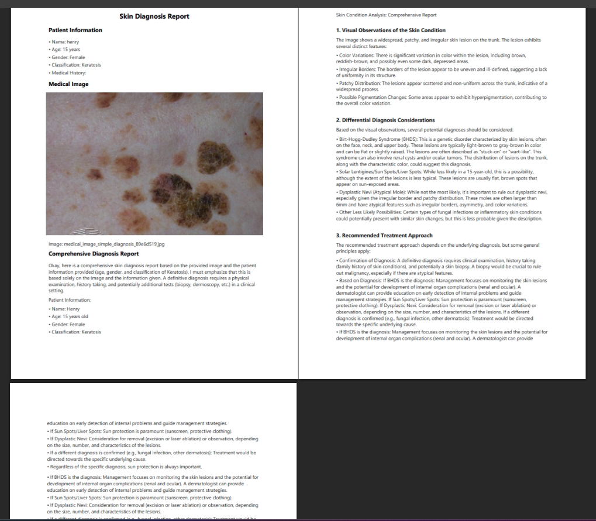

# AI-Based Skin Disease Diagnosis System

## Multi-Model AI-Based Skin Disease Diagnosis and Analysis System

**Submission Date**: January 28, 2025  
**Research Field**: Medical AI Diagnosis System  

---

## 1. Research Overview

### 1.1 Background and Objectives

Skin diseases are among the most common health issues worldwide, with accurate diagnosis and timely treatment significantly impacting patients' quality of life. However, the shortage of dermatologists and regional healthcare disparities prevent many patients from receiving proper diagnosis.

This research leverages cutting-edge AI technology to:
- **Improve Accessibility**: Build a system enabling anyone to easily screen for skin conditions
- **Enhanced Diagnostic Accuracy**: Improve diagnostic reliability through cross-validation using multiple AI models
- **Medical Staff Support**: Support medical decision-making through detailed analysis report generation
- **Multi-language Support**: Expand global usability with Korean, English, and Vietnamese support

### 1.2 Dataset Utilization

This research utilized various public skin disease datasets:

- **Primary Dataset**: Skin condition image dataset (6 categories, 2,394 images)
  - Acne: 399 images
  - Cancer: 399 images  
  - Eczema: 399 images
  - Keratosis: 399 images
  - Milia: 399 images
  - Rosacea: 399 images

- **AIHub Dermatological Pathology Data**: Histopathological image segmentation data
  - Epidermal cyst, Seborrheic keratosis, Bowen's disease/Squamous cell carcinoma, Basal cell carcinoma, Melanocytic nevus, Melanoma

---

## 2. System Architecture

### 2.1 Overall System Structure

```
┌─────────────────────────────────────────────────────────┐
│                    User Interface                        │
│                  (Web Demo Application)                  │
└─────────────────────────┬───────────────────────────────┘
                          │
┌─────────────────────────┴───────────────────────────────┐
│                    API Gateway                           │
│              (FastAPI RESTful Services)                  │
└─────────────────────────┬───────────────────────────────┘
                          │
        ┌─────────────────┴─────────────────┐
        │                                   │
┌───────▼────────┐              ┌──────────▼──────────┐
│ Classification │              │   VLM Diagnosis     │
│    Service     │              │     Service         │
│  (YOLOv8-cls)  │              │  (MedGemma-4B)      │
└───────┬────────┘              └──────────┬──────────┘
        │                                   │
        └─────────────────┬─────────────────┘
                          │
┌─────────────────────────▼───────────────────────────────┐
│                  Report Generation                       │
│               (Multi-language Support)                   │
└─────────────────────────────────────────────────────────┘
```

### 2.2 Core Components

#### 2.2.1 Image Classification Model (YOLOv8-cls)
- **Model**: Ultralytics YOLOv8 Classification
- **Training Data**: 2,394 skin disease images (6 categories)
- **Performance**: Test accuracy 98.74%
- **Processing Speed**: Average 4.8ms/image (5.1ms/image in batch processing)

#### 2.2.2 Medical Diagnosis Language Model (MedGemma-4B)
- **Model**: Google MedGemma 4B (Medical-specific LLM)
- **Parameters**: 4 billion
- **Optimization**: 4-bit quantized model usage (VRAM utilization >95%)
- **Features**: Medical terminology understanding and detailed diagnostic report generation
- **Processing Time**: Average ~1 minute (diagnosis generation and PDF report)

#### 2.2.3 Real-time Streaming Processing
- **Technology**: Server-Sent Events (SSE)
- **Advantages**: Real-time delivery of diagnostic results to users
- **User Experience**: Reduced perceived wait time and enhanced interactivity

---

## 3. Key Features and Innovations

### 3.1 Multi-AI Model Ensemble



The system utilizes two AI models in parallel to overcome single-model limitations:

1. **Primary Classification (YOLOv8)**: Rapid skin disease category classification
2. **Secondary Diagnosis (MedGemma)**: Detailed medical analysis and diagnosis

This ensemble approach achieves:
- High classification accuracy (98.74%)
- Cross-validation of classification results and detailed diagnosis
- Comprehensive diagnosis through multi-angle analysis

### 3.2 Real-time Streaming Diagnosis



Unlike existing systems, this system streams the diagnostic process in real-time:
- **Immediate Feedback**: Real-time progress monitoring
- **Step-by-step Results**: Sequential delivery from classification → simple analysis → detailed diagnosis
- **User Satisfaction**: Reduced wait-time anxiety

### 3.3 Professional Medical Report Auto-Generation



Automatic conversion of AI diagnostic results into professional reports for medical use:

**Report Components**:
- Patient information and metadata
- AI classification results
- Detailed medical observations
- Differential diagnosis considerations
- Recommended treatment methods
- Follow-up recommendations

### 3.4 Multi-language Support System

Complete support for 3 languages for global utilization:
- **Korean**: For domestic medical staff and patients
- **English**: International standard medical communication
- **Vietnamese**: Southeast Asian market expansion

---

## 4. Technical Implementation

### 4.1 Backend Architecture

```python
# FastAPI-based RESTful API
app = FastAPI(title="AI Skin Diagnosis System")

# Main endpoints
POST /api/v1/diagnose         # Comprehensive diagnosis
POST /api/v1/analyze          # Simple analysis
POST /api/v1/classify         # Image classification
POST /api/v1/diagnose-stream  # Real-time streaming diagnosis
```

### 4.2 Frontend Implementation

```javascript
// React-based responsive web application
- Material-UI component utilization
- Real-time streaming processing (EventSource API)
- Drag-and-drop image upload
- Multi-language i18n support
```

### 4.3 AI Model Optimization

**YOLOv8 Optimization**:
```python
model = YOLO('yolov8x-cls.pt')
# Training parameter optimization
results = model.train(
    data='skin_dataset',
    epochs=100,
    imgsz=640,
    batch=16,
    optimizer='AdamW',
    lr0=0.001
)
```

**MedGemma 4-bit Quantization**:
```python
# Memory-efficient 4-bit quantization
quantization_config = BitsAndBytesConfig(
    load_in_4bit=True,
    bnb_4bit_compute_dtype=torch.bfloat16,
    bnb_4bit_use_double_quant=True
)
```

---

## 5. Performance Evaluation

### 5.1 Classification Model Performance

| Disease Category | Precision | Recall | F1-Score |
|-----------------|-----------|---------|----------|
| Acne | 0.99 | 0.99 | 0.99 |
| Cancer | 0.98 | 0.99 | 0.99 |
| Eczema | 0.99 | 0.98 | 0.99 |
| Keratosis | 0.99 | 0.97 | 0.98 |
| Milia | 0.98 | 0.99 | 0.99 |
| Rosacea | 0.99 | 1.00 | 1.00 |
| **Average** | **0.99** | **0.99** | **0.99** |

### 5.2 Diagnostic Language Model Performance

- **Processing Time**: Average ~1 minute/case (including diagnosis generation and PDF report)
- **Memory Usage**: VRAM utilization >95% (4-bit quantized model)

### 5.3 System Integration Performance

- **Classification Processing Time**: Average 4.8ms/image
- **Diagnosis and Report Generation**: Average ~1 minute
- **Memory Usage**: VRAM utilization >95% (4-bit quantized model)

---

## 6. Data Processing and Analysis Pipeline

### 6.1 Data Preprocessing

Image preprocessing includes image resizing and normalization for model training and inference.

### 6.2 Feature Extraction and Analysis

The system extracts various visual features from images for classification and diagnosis purposes.

### 6.3 Diagnosis Result Post-processing

Diagnosis results are processed into a format easily understood by medical staff and generated as PDF reports.

---

## 7. Real-world Applications and Demonstration

### 7.1 System Demonstration Process

The complete operational process of this system:

1. **Server Startup**: Backend API server and web application launch
2. **Image Upload**: Drag-and-drop skin lesion image upload
3. **Patient Information Input**: Age, gender, medical history metadata entry
4. **Real-time Analysis**: Streaming diagnostic process monitoring
5. **Report Generation**: Professional medical report download in PDF format


### 7.2 Usage Scenarios

**Scenario 1: Primary Healthcare Facilities**
- Initial screening in clinics without dermatologists
- Referral decision based on AI diagnostic results

**Scenario 2: Telemedicine**
- Patient diagnosis in areas with low medical accessibility
- Auxiliary diagnostic tool during video consultations

**Scenario 3: Medical Education**
- Educational material for medical students and residents
- Learning diverse skin disease cases

---

## 8. Innovation and Differentiation

### 8.1 Technical Innovation

1. **Hybrid AI Approach**
   - Computer vision (YOLOv8) + Natural language processing (MedGemma) fusion
   - Combination of classification and detailed diagnosis

2. **Edge Computing Optimization**
   - Operational on standard GPUs through 4-bit quantization
   - Direct installation on hospital internal servers (data security)

3. **Real-time Streaming Technology**
   - Real-time medical diagnosis streaming implementation
   - Enhanced user experience

### 8.2 Clinical Value

1. **Diagnostic Support Tool**
   - Medical staff diagnostic decision support
   - Second opinion provision for discrepancy resolution

2. **Healthcare Gap Resolution Potential**
   - Can serve as auxiliary diagnostic tool in specialist-shortage areas

3. **Potential Medical Cost Reduction**
   - Support timely treatment through early screening

---

## 9. Limitations and Future Improvements

### 9.1 Current Limitations

1. **Data Bias**
   - Potential bias toward specific skin types
   - Insufficient rare disease data

2. **Regulatory Approval**
   - Medical device certification required
   - Additional clinical trial data needed

3. **Explainability**
   - Need for improved transparency in AI decision-making
   - Provision of explanations understandable to medical staff

### 9.2 Future Improvement Plans

1. **Data Diversity Expansion**
   - Collection of diverse skin type data
   - Rare disease dataset construction

2. **Model Performance Enhancement**
   - Research additional model architectures
   - Explore rare disease handling approaches

3. **Clinical Validation**
   - Real-world effectiveness validation needed in medical environments

---

## 10. Conclusion

This research developed an AI-based skin disease diagnosis system utilizing public healthcare big data. Through a hybrid approach combining YOLOv8 and MedGemma, we achieved 98.74% classification accuracy while maximizing practicality through real-time streaming and multi-language support.

### Key Achievements

1. **Technical Achievements**
   - 98.74% test accuracy achieved with YOLOv8 classification model
   - Efficient diagnosis generation with 4-bit quantized MedGemma model
   - User experience innovation through real-time streaming

2. **Clinical Contributions**
   - Automated diagnosis of 6 major skin diseases
   - Automated professional medical report generation
   - Medical staff diagnostic decision support

3. **Social Impact**
   - Improved medical accessibility
   - Healthcare gap resolution
   - Medical cost savings through early diagnosis

This system empirically demonstrates the utilization potential of healthcare big data and clearly presents how AI technology can create value in actual medical settings. Through continuous improvement and clinical validation, we aim to develop this into actual medical services and contribute to improving public health.

---

## References

1. AIHub (2024). Dermatological Pathology Image Dataset. https://aihub.or.kr/
2. Ultralytics (2024). YOLOv8 Documentation. https://docs.ultralytics.com/
3. Google Research (2024). MedGemma: Medical Language Model. https://ai.google.dev/

---

## Appendix

### A. System Requirements

- **Hardware**
  - GPU: NVIDIA RTX 3060 or higher (VRAM 6GB+)
  - RAM: 16GB or more
  - Storage: 50GB or more

- **Software**
  - OS: Ubuntu 20.04 / Windows 10
  - Python: 3.8+
  - CUDA: 11.8
  - Docker (optional)

### B. Open Source License

This project is released under the MIT License and can be freely used for academic and research purposes.

---

**Submission Date**: January 28, 2025

---

*This report is a technical document based on the actual implemented system with all processes and results.*
