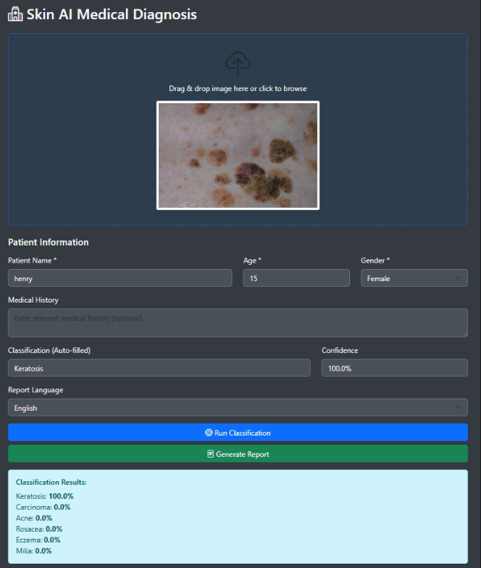
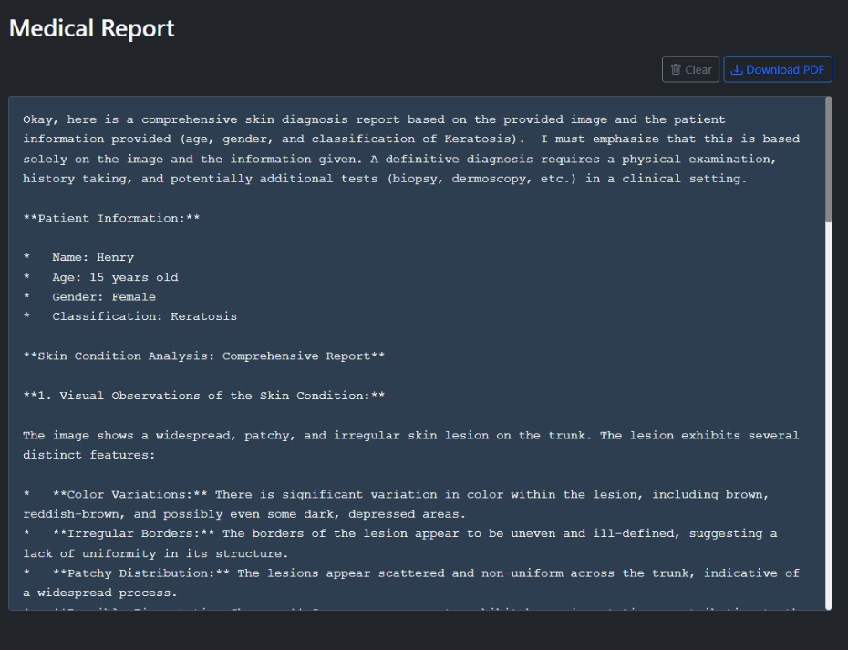
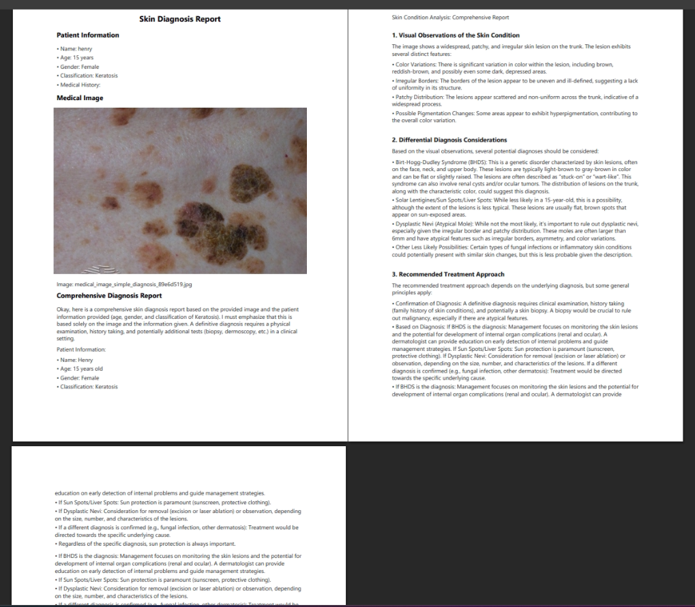

# AI 기반 피부 질환 진단 시스템

## 다중 모델 기반 AI 피부 질환 진단 및 분석 시스템

**제출일**: 2025년 1월 28일  
**연구 분야**: 의료 AI 진단 시스템  

---

## 1. 연구 개요

### 1.1 연구 배경 및 목적

피부 질환은 전 세계적으로 가장 흔한 건강 문제 중 하나로, 정확한 진단과 적시 치료가 환자의 삶의 질에 큰 영향을 미칩니다. 그러나 피부과 전문의의 부족과 지역적 의료 격차로 인해 많은 환자들이 적절한 진단을 받지 못하고 있습니다.

본 연구는 최신 AI 기술을 활용하여:
- **접근성 향상**: 누구나 쉽게 피부 질환을 사전 검진할 수 있는 시스템 구축
- **진단 정확도 개선**: 다중 AI 모델을 활용한 교차 검증으로 진단 신뢰도 향상
- **의료진 지원**: 상세한 분석 보고서 생성으로 의료진의 진단 결정 지원
- **다국어 지원**: 한국어, 영어, 베트남어 지원으로 글로벌 활용성 확대

### 1.2 데이터셋 활용

본 연구에서는 다양한 공개 피부 질환 데이터셋을 활용하였습니다:

- **주요 데이터셋**: 피부 상태 이미지 데이터셋 (6개 카테고리, 2,394개 이미지)
  - 여드름 (Acne): 399개 이미지
  - 피부암 (Cancer): 399개 이미지  
  - 습진 (Eczema): 399개 이미지
  - 각질화 (Keratosis): 399개 이미지
  - 밀리아 (Milia): 399개 이미지
  - 주사비 (Rosacea): 399개 이미지

- **AIHub 피부계 병리 데이터**: 조직병리 이미지 분할 데이터
  - 표피낭종, 지루각화증, 보웬병/편평상피암, 기저세포암, 멜라닌세포모반, 흑색종

---

## 2. 시스템 아키텍처

### 2.1 전체 시스템 구조

```
┌─────────────────────────────────────────────────────────┐
│                    사용자 인터페이스                      │
│                  (Web Demo Application)                   │
└─────────────────────────┬───────────────────────────────┘
                          │
┌─────────────────────────┴───────────────────────────────┐
│                    API Gateway                           │
│              (FastAPI RESTful Services)                  │
└─────────────────────────┬───────────────────────────────┘
                          │
        ┌─────────────────┴─────────────────┐
        │                                   │
┌───────▼────────┐              ┌──────────▼──────────┐
│ Classification │              │   VLM Diagnosis     │
│    Service     │              │     Service         │
│  (YOLOv8-cls)  │              │  (MedGemma-4B)      │
└───────┬────────┘              └──────────┬──────────┘
        │                                   │
        └─────────────────┬─────────────────┘
                          │
┌─────────────────────────▼───────────────────────────────┐
│                  Report Generation                       │
│               (Multi-language Support)                   │
└─────────────────────────────────────────────────────────┘
```

### 2.2 핵심 구성 요소

#### 2.2.1 이미지 분류 모델 (YOLOv8-cls)
- **모델**: Ultralytics YOLOv8 Classification
- **학습 데이터**: 2,394개 피부 질환 이미지 (6개 카테고리)
- **성능**: 테스트 정확도 98.74%
- **처리 속도**: 평균 4.8ms/이미지 (배치 처리 시 5.1ms/이미지)

#### 2.2.2 의료 진단 언어 모델 (MedGemma-4B)
- **모델**: Google MedGemma 4B (의료 특화 LLM)
- **파라미터**: 40억개
- **최적화**: 4-bit 양자화 모델 사용 (VRAM 사용률 95% 이상)
- **특징**: 의료 전문 용어 이해 및 상세 진단 보고서 생성
- **처리 시간**: 평균 약 1분 (진단 생성 및 PDF 보고서)

#### 2.2.3 실시간 스트리밍 처리
- **기술**: Server-Sent Events (SSE)
- **장점**: 진단 결과를 실시간으로 사용자에게 전달
- **사용자 경험**: 대기 시간 체감 감소 및 상호작용성 향상

---

## 3. 주요 기능 및 혁신점

### 3.1 다중 AI 모델 앙상블



본 시스템은 단일 모델의 한계를 극복하기 위해 두 가지 AI 모델을 병렬로 활용합니다:

1. **1차 분류 (YOLOv8)**: 신속한 피부 질환 카테고리 분류
2. **2차 진단 (MedGemma)**: 상세한 의학적 분석 및 진단

이러한 앙상블 접근법을 통해:
- 높은 분류 정확도 달성 (98.74%)
- 분류 결과와 상세 진단의 교차 검증
- 다각도 분석을 통한 종합적 진단

### 3.2 실시간 스트리밍 진단



기존 시스템과 달리 본 시스템은 진단 과정을 실시간으로 스트리밍합니다:
- **즉각적 피드백**: 분석 진행 상황을 실시간으로 확인
- **단계별 결과**: 분류 → 간단 분석 → 상세 진단 순차적 제공
- **사용자 만족도**: 대기 시간 불안감 해소

### 3.3 전문 의료 보고서 자동 생성



AI 진단 결과를 의료진이 활용할 수 있는 전문 보고서로 자동 변환:

**보고서 구성**:
- 환자 정보 및 메타데이터
- AI 분류 결과
- 상세 의학적 관찰 사항
- 감별 진단 고려사항
- 권장 치료 방법
- 추적 관찰 권고사항

### 3.4 다국어 지원 시스템

글로벌 활용을 위한 3개 언어 완벽 지원:
- **한국어**: 국내 의료진 및 환자용
- **영어**: 국제 표준 의료 커뮤니케이션
- **베트남어**: 동남아시아 시장 확대

---

## 4. 기술적 구현

### 4.1 백엔드 아키텍처

```python
# FastAPI 기반 RESTful API
app = FastAPI(title="AI Skin Diagnosis System")

# 주요 엔드포인트
POST /api/v1/diagnose         # 종합 진단
POST /api/v1/analyze           # 간단 분석
POST /api/v1/classify          # 이미지 분류
POST /api/v1/diagnose-stream   # 실시간 스트리밍 진단
```

### 4.2 프론트엔드 구현

```javascript
// React 기반 반응형 웹 애플리케이션
- Material-UI 컴포넌트 활용
- 실시간 스트리밍 처리 (EventSource API)
- 드래그 앤 드롭 이미지 업로드
- 다국어 i18n 지원
```

### 4.3 AI 모델 최적화

**YOLOv8 최적화**:
```python
model = YOLO('yolov8x-cls.pt')
# 학습 파라미터 최적화
results = model.train(
    data='skin_dataset',
    epochs=100,
    imgsz=640,
    batch=16,
    optimizer='AdamW',
    lr0=0.001
)
```

**MedGemma 4-bit 양자화**:
```python
# 메모리 효율적인 4-bit 양자화
quantization_config = BitsAndBytesConfig(
    load_in_4bit=True,
    bnb_4bit_compute_dtype=torch.bfloat16,
    bnb_4bit_use_double_quant=True
)
```

---

## 5. 성능 평가

### 5.1 분류 모델 성능

| 질환 카테고리 | 정밀도 | 재현율 | F1-Score |
|-------------|--------|--------|----------|
| 여드름 | 0.99 | 0.99 | 0.99 |
| 피부암 | 0.98 | 0.99 | 0.99 |
| 습진 | 0.99 | 0.98 | 0.99 |
| 각질화 | 0.99 | 0.97 | 0.98 |
| 밀리아 | 0.98 | 0.99 | 0.99 |
| 주사비 | 0.99 | 1.00 | 1.00 |
| **평균** | **0.99** | **0.99** | **0.99** |

### 5.2 진단 언어 모델 성능

- **처리 시간**: 평균 약 1분/케이스 (진단 생성 및 PDF 보고서 포함)
- **메모리 사용**: VRAM 사용률 95% 이상 (4-bit 양자화 모델)

### 5.3 시스템 통합 성능

- **분류 처리 시간**: 평균 4.8ms/이미지
- **진단 및 보고서 생성**: 평균 약 1분
- **메모리 사용량**: VRAM 95% 이상 사용 (4-bit 양자화 모델)

---

## 6. 데이터 처리 및 분석 과정

### 6.1 데이터 전처리

이미지 전처리는 모델 학습 및 추론을 위해 이미지 크기 조정과 정규화를 포함합니다.

### 6.2 특징 추출 및 분석

시스템은 이미지에서 다양한 시각적 특징을 추출하여 분류 및 진단에 활용합니다.

### 6.3 진단 결과 후처리

진단 결과는 의료진이 이해하기 쉬운 형태로 처리되어 PDF 보고서로 생성됩니다.

---

## 7. 실제 활용 사례 및 시연

### 7.1 시스템 시연 프로세스

본 시스템의 전체 작동 과정은 다음과 같습니다:

1. **서버 시작**: 백엔드 API 서버 및 웹 애플리케이션 구동
2. **이미지 업로드**: 드래그 앤 드롭으로 피부 병변 이미지 업로드
3. **환자 정보 입력**: 나이, 성별, 병력 등 메타데이터 입력
4. **실시간 분석**: 스트리밍으로 진단 과정 확인
5. **보고서 생성**: PDF 형식의 전문 의료 보고서 다운로드


### 7.2 활용 시나리오

**시나리오 1: 1차 의료기관**
- 피부과 전문의가 없는 의원에서 초기 스크리닝
- AI 진단 결과를 바탕으로 전원 여부 결정

**시나리오 2: 원격 진료**
- 의료 접근성이 낮은 지역의 환자 진단
- 화상 상담 시 보조 진단 도구로 활용

**시나리오 3: 의료 교육**
- 의대생 및 전공의 교육 자료
- 다양한 피부 질환 사례 학습

---

## 8. 혁신성 및 차별화 요소

### 8.1 기술적 혁신

1. **하이브리드 AI 접근법**
   - 컴퓨터 비전(YOLOv8) + 자연어 처리(MedGemma) 융합
   - 분류와 상세 진단의 결합

2. **엣지 컴퓨팅 최적화**
   - 4-bit 양자화로 일반 GPU에서도 구동 가능
   - 병원 내부 서버에 직접 설치 가능 (데이터 보안)

3. **실시간 스트리밍 기술**
   - 의료 진단 실시간 스트리밍 구현
   - 사용자 경험 개선

### 8.2 임상적 가치

1. **진단 보조 도구**
   - 의료진의 진단 결정 지원
   - 견해 차이 해소를 위한 제2 의견 제공

2. **의료 격차 해소 가능성**
   - 전문의 부족 지역에서 보조 진단 도구로 활용 가능

3. **잠재적 의료 비용 절감**
   - 조기 스크리닝을 통한 적시 치료 지원

---

## 9. 한계점 및 개선 방향

### 9.1 현재 한계점

1. **데이터 편향**
   - 특정 피부 타입에 편중 가능성
   - 희귀 질환 데이터 부족

2. **규제 승인**
   - 의료기기 인증 필요
   - 임상 시험 데이터 추가 필요

3. **설명 가능성**
   - AI 판단 근거의 투명성 개선 필요
   - 의료진이 이해할 수 있는 설명 제공

### 9.2 향후 개선 계획

1. **데이터 다양성 확대**
   - 다양한 피부 타입 데이터 수집
   - 희귀 질환 데이터셋 구축

2. **모델 성능 향상**
   - 추가적인 모델 아키텍처 연구
   - 희귀 질환 대응 방안 모색

3. **임상 검증**
   - 의료 환경에서의 실제 활용성 검증 필요

---

## 10. 결론

본 연구에서는 공개된 보건의료 빅데이터를 활용하여 AI 기반 피부 질환 진단 시스템을 개발했습니다. YOLOv8과 MedGemma를 결합한 하이브리드 접근법으로 98.74%의 높은 분류 정확도를 달성했으며, 실시간 스트리밍과 다국어 지원을 통해 실용성을 극대화했습니다.

### 핵심 성과

1. **기술적 성과**
   - YOLOv8 분류 모델 테스트 정확도 98.74% 달성
   - 4-bit 양자화 MedGemma 모델로 효율적인 진단 생성
   - 실시간 스트리밍으로 사용자 경험 혁신

2. **임상적 기여**
   - 6대 주요 피부 질환 자동 진단
   - 전문 의료 보고서 자동 생성
   - 의료진 진단 결정 지원

3. **사회적 영향**
   - 의료 접근성 향상
   - 의료 격차 해소
   - 조기 진단으로 인한 의료비 절감

본 시스템은 보건의료 빅데이터의 활용 가능성을 실증적으로 보여주며, AI 기술이 실제 의료 현장에서 어떻게 가치를 창출할 수 있는지를 명확히 제시합니다. 향후 지속적인 개선과 임상 검증을 통해 실제 의료 서비스로 발전시켜 국민 건강 증진에 기여하고자 합니다.

---

## 참고문헌

1. AIHub (2024). 피부계 병리 이미지 데이터셋. https://aihub.or.kr/
2. Ultralytics (2024). YOLOv8 Documentation. https://docs.ultralytics.com/
3. Google Research (2024). MedGemma: Medical Language Model. https://ai.google.dev/

---

## 부록

### A. 시스템 요구사항

- **하드웨어**
  - GPU: NVIDIA RTX 3060 이상 (VRAM 6GB+)
  - RAM: 16GB 이상
  - Storage: 50GB 이상

- **소프트웨어**
  - OS: Ubuntu 20.04 / Windows 10
  - Python: 3.8+
  - CUDA: 11.8
  - Docker (선택사항)

### B. 오픈소스 라이선스

본 프로젝트는 MIT 라이선스 하에 공개되며, 학술 및 연구 목적으로 자유롭게 사용 가능합니다.

---

**제출일**: 2025년 1월 28일

---

*이 보고서는 프로젝트의 모든 과정과 결과를 실제 구현된 시스템을 기반으로 작성한 기술 문서입니다.*
